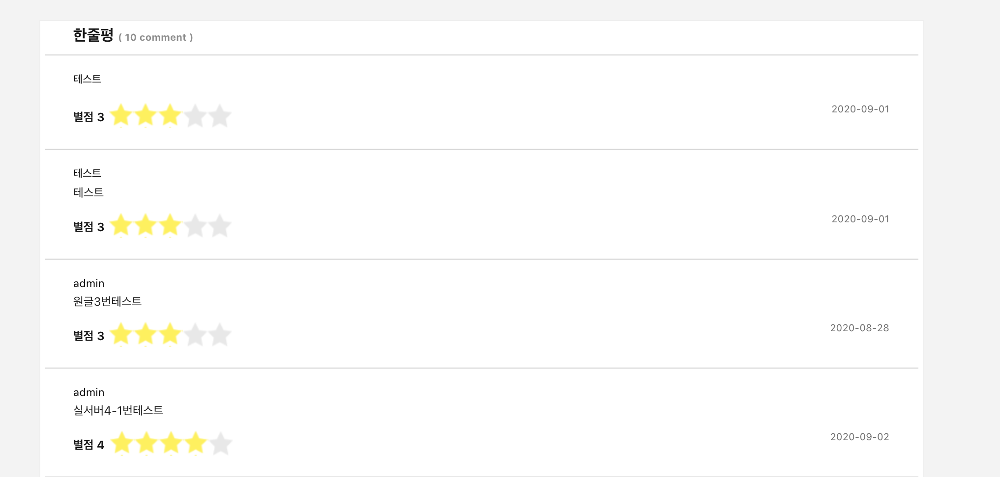
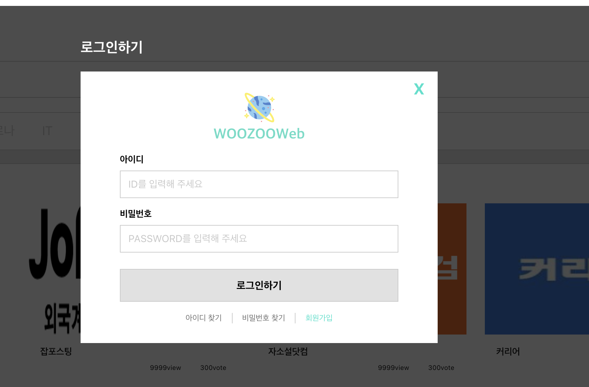

프로젝트 개요

기술 스택 
backend - java spring boot 2.x.x 
fronted - react redux redux-saga react-router 등등.. 
database - mariadb

</img>
</img>
</img>
</img>
 
기능정의
 
[o]서비스 작성 
[o]서비스 수정 
[o]서비스 삭제 
[o]서비스 리스트 조회 
[o]서비스 상세 조회 
[o]서비스리스트사진파일 
[o]서비스 댓글 작성 
[o]서비스 댓글 수정 
[o]서비스 댓글 리스트 
[o]서비스 댓글 삭제 
[o]서비스 대댓글 달기 
 
[o]서비스 별점 
[]서비스 별점 취소 

[o]주제(카테고리 조회) 
[o]주제(카테고리 저장) 
[o]주제(카테고리 수정) 
[o]주제(카테고리 삭제) 
 
[o]회원 가입 
[]회원 수정 
[o]회원 삭제 
[o]로그인 
[]비밀번호찾기 
[]아이디 찾기 
 
[]서비스 즐겨찾기 
 
[o]관리자 서비스승인 
